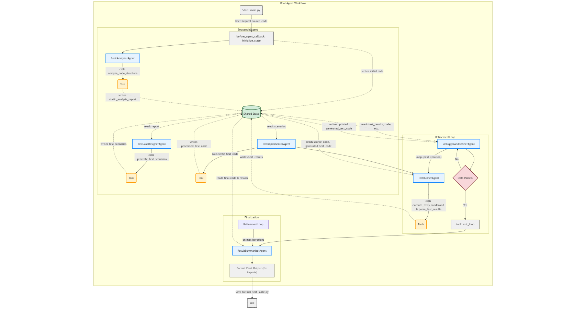

# TestMozart - AI-Powered Test Generation



**TestMozart** automatically generates comprehensive test suites for **Python** and **C** code using Google's Agent Development Kit (ADK). Six specialized AI agents collaborate to analyze code, design test scenarios, implement tests, and refine them until they pass.

## 🚀 Quick Start

### Prerequisites
- Python 3.8+
- Google AI API Key OR Google Cloud credentials
- gcc compiler (for C testing)

### Installation
```bash
# Clone and setup
git clone <repository>
cd testmozart
pip install -r requirements.txt

# For Google Cloud Shell (recommended)
gcloud auth application-default login
gcloud auth application-default set-quota-project YOUR_PROJECT_ID
export GOOGLE_GENAI_USE_VERTEXAI=1
export GOOGLE_CLOUD_PROJECT=YOUR_PROJECT_ID

# For local development
echo "GOOGLE_API_KEY=your_api_key_here" > .env
```

### Usage
```bash
# Test Python code
python main.py  # (TEST_FILE_PATH = "sample_code.py")

# Test C code  
python main.py  # (TEST_FILE_PATH = "sample_code.c")

# Run generated tests manually
pytest -v final_test_suite.py                    # Python
gcc -o test_runner final_test_suite.c -std=c99 && ./test_runner  # C
```

## 🏗️ How It Works

### Multi-Agent Workflow
1. **CodeAnalyzer** - Static analysis of source code
2. **TestCaseDesigner** - Generates comprehensive test scenarios  
3. **TestImplementer** - Converts scenarios to executable test code
4. **TestRunner** - Executes tests in sandboxed environment
5. **DebuggerAndRefiner** - Fixes failing tests (max 3 iterations)
6. **ResultSummarizer** - Formats final test suite

### Supported Languages
- **Python**: pytest framework with comprehensive assertions
- **C**: Simple C assertions with custom test framework (no Unity dependency)

## 📁 Project Structure

```
testmozart/
├── main.py                    # Main entry point
├── agents/                    # AI agent implementations
│   ├── coordinator.py        # Workflow coordinator
│   ├── code_analyzer.py      # Static code analysis
│   ├── test_case_designer.py # Test scenario generation
│   ├── test_implementer.py   # Test code implementation
│   ├── test_runner.py        # Test execution
│   └── debugger_and_refiner.py # Test debugging
├── tools/                    # Specialized tools for agents
├── docs/                     # Documentation
├── TESTS.txt                 # Testing guide
└── setup_c.py               # C dependency setup
```

## 🎯 Example Output

### Input: `sample_code.c`
```c
typedef struct { int result; } Calculator;
int add(Calculator* calc, int a, int b) {
    calc->result = a + b;
    return calc->result;
}
```

### Generated Test: `final_test_suite.c`
```c
#include <stdio.h>
#include <stdlib.h>
#include <string.h>
#include "sample_code.c"

int tests_passed = 0;
int tests_failed = 0;

#define ASSERT_EQUAL(expected, actual, message) \
    do { \
        if ((expected) == (actual)) { \
            printf("✅ PASS: %s\n", message); \
            tests_passed++; \
        } else { \
            printf("❌ FAIL: %s\n", message); \
            tests_failed++; \
        } \
    } while(0)

void test_add_positive_integers() {
    Calculator calc;
    int result = add(&calc, 5, 3);
    ASSERT_EQUAL(8, result, "add(5, 3) should return 8");
}

int main() {
    printf("🧪 Running C Tests...\n");
    test_add_positive_integers();
    printf("✅ Passed: %d\n", tests_passed);
    printf("❌ Failed: %d\n", tests_failed);
    return tests_failed == 0 ? 0 : 1;
}
```

## 🛠️ Key Features

- **🤖 AI-Powered**: Six specialized agents with different expertise
- **🔒 Sandboxed**: Safe test execution in isolated environments  
- **🔄 Self-Healing**: Automatic retry and refinement of failing tests
- **📊 Comprehensive**: Covers happy path, edge cases, and error handling
- **⚡ Fast**: 1-3 minutes for typical codebases
- **🌐 Multi-Language**: Python (pytest) and C (simple assertions)

## 📚 Documentation

- **`TESTS.txt`** - Complete testing guide with setup instructions
- **`docs/`** - Detailed architecture and usage documentation
- **`setup_c.py`** - Automated C dependency setup

## ⚠️ Troubleshooting

### Google Cloud Issues
```bash
# Set quota project
gcloud auth application-default set-quota-project YOUR_PROJECT_ID

# Enable APIs
gcloud services enable aiplatform.googleapis.com
```

### C Compilation Issues
```bash
# Install gcc
python setup_c.py  # Automated setup
# OR manually: sudo apt-get install gcc
```

### Common Errors
- **API Errors**: Temporary Google API issues - wait and retry
- **File Not Found**: Ensure `sample_code.py` or `sample_code.c` exists
- **Import Errors**: Normal during execution - final output corrects imports

## 🎯 Best Practices

### For Source Code
- Use clear, descriptive function/class names
- Include type hints (Python) or proper declarations (C)
- Keep functions focused and simple

### For Testing
- Review generated tests before use
- Run tests manually to verify: `pytest -v final_test_suite.py`
- Add additional edge cases if needed

## 🚀 Next Steps

1. **Review** generated test suite
2. **Run** tests manually to verify
3. **Integrate** into your development workflow
4. **Customize** tests for specific requirements
5. **Add** to your CI/CD pipeline

---

*TestMozart combines AI agents with robust software engineering to deliver comprehensive, reliable test suites with minimal human intervention.*